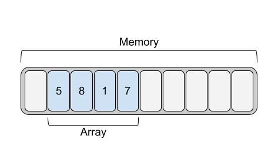
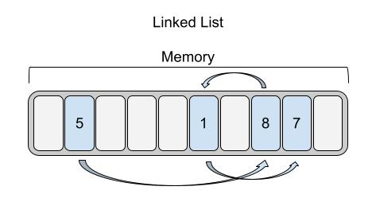
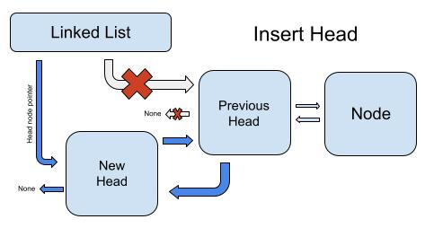
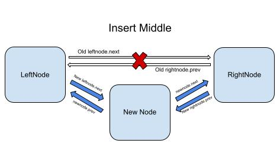
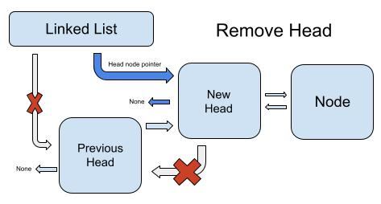
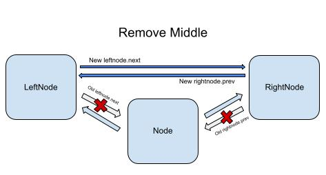

# Linked List Data Structure

## Introduction

A linked list data structure is somewhat similar to dynamic arrays, with some very important differences. Dynamic arrays store data in a contiguous location, meaning, the first element is right next to the second, which is right next to the third, etc. Linked lists, however, are stored differently. Each element in a linked list could be in a totally random location. So how do we know where each element is? This is where **nodes**  come in.

A node serves a couple main purposes. First, a node contains an element in the linked list. Second, a node contains a link to the next node in the list, also known as a **pointer**. Usually, nodes in a linked list also contain pointers to the previous node. A linked list data structure usually stores the location of the first and last nodes, called the **head** node and the **tail** node respectively.

If we only have pointers to the head and tail nodes, how do we access an element somewhere in the middle of the list? To do this, we need to iterate through the nodes, following the trail of pointers until we find the node that contains the element we are looking for. Unfortunately, this means that using a node somewhere in the middle is a performance of O(n). Recall that with dynamic arrays, we can use random access to access a middle element with a performance of O(1). So why, then, should we use a linked list over a dynamic array? To determine this, let's look at the performance.

With Python, we can use the deque class as a linked list.

## Performance

| Operation           | Python Code              | Performance |
|---------------------|--------------------------|-------------|
| insert_head(value)  | `deque.appendleft(value)`| O(1)        |
| insert_tail(value)  | `deque.append(value)`    | O(1)        |
| insert(index, value)| `deque.insert(i, value)` | O(n)        |
| remove_head()       | `deque.popleft()`        | O(1)        |
| remove_tail()       | `deque.pop()`            | O(1)        |
| remove(index)       | `del deque[index]`       | O(n)        |
| size()              | `len(deque)`             | O(1)        |
| empty()             | `len(deque) == 0`        | O(1)        |

Let's discuss the reasons behind the performance, as well as why you might use a linked list instead of a dynamic array.

As mentioned before, inserting or deleting a node somewhere in the middle is O(n), because we have to iterate through all the nodes before it to get to that node. Meanwhile, operations that insert or remove nodes from the beginning or end are O(1). This makes the linked list an excellent choice for a data structure where the majority of opperations will be at the beginning or end of the list. A great example of this is a queue, which is another type of data structure. This is because the queue always adds to the tail, and removes from the head, making its opperations only O(1).

With dynamic arrays, inserting to the head, or anywhere else in the array besides the tail, is O(n), because it needs to shift back each element behind it. Inserting at the head of a linked list is O(1).

To recap:

Strengths:
* Insert at head or tail
* Remove head or tail

Weaknesses:
* Insert/remove element in the middle
* Access element in the middle

## Diving Deeper: How Linked Lists Work

We already discussed that a linked list consists of nodes, each pointing to the next and previous node. So lets both visualize this, and explain how each operation is performed.

The image below is an example of what a dynamic array might look like in memory.



While the dynamic array has each element in a sequence, a linked list could have nodes all over the place, each pointing to the next node. This is shown below.



Now that you can see what the linked list looks like in memory, lets examine some common opperations.

### Inserting at head/tail



The operations for inserting at the head and the tail are mostly the same.

Inside our linked list, we have two different objects with pointers to the head node. First, we have the linked list object, which stores a pointer to the head. We also have the second node which stores a pointer to the head. We need to make some changes to the pointers to insert the head node.

First, we want to create the new node. Once this is done, we set the next_node attribute in the new node to be the current head of the list. Then, we set the previous node on that next_node to be the new node. Lastly, we set the head node of the linked list to the newly created node.

If the new node is the only node, we will set both next_node and prev_node to None in the new node. We will also set both head and tail to be the same node.

### Inserting in the middle



The operation to insert in the middle follows a similar approach, except to get to that middle node we first have to iterate through all the nodes before it.

Once we have the position, we will create the new node. Since we are inserting between two other nodes, we will call the node before it the left node, and the node after it the right node. Once the new node is created, we will set the prev_node and the next_node attributes of the new node to the left node and the right node, respectively.

Now, we will have to disconnect the right node from the left node, and connect them to the new node. To do this, we will take next_node on the left node, and prev_node on the right node and set them both to this new node. Once we have done this, we have successfully inserted a brand new node into the middle of the linked list!

### Removing head/tail



To remove the head, we are going to once again change around some pointers. This time, instead of assigning pointers to a new node, we are going to reassign pointers to the nodes around the node that we want to delete. It Python, once we remove all references to the node we want to delete, that node will be completely deleted.

To start, we want to store the element that the head/tail node contains to a variable, so that we can return it later. Next, we want to set the head node to the current head node's next_node. Now, we can take the new head node and set its prev_node to None. At this point, the head node has now been deleted, and we can return the element which it held.

### Removing middle node



When we remove a middle node, the first thing we have to do is iterate through the nodes until we get to the one that we want. At this point, we set the left node's next_node to the right node, and the right node's prev_node to the left node. Now we can return the node's value.

## Example

Let's walk through an example problem and how we can use a linked list to come to a solution. For this example problem, we will use the Python deque linked list, and use it as a queue.

### The Problem

For the example problem, we will create a playlist which allows the user to add songs, listen to songs, and remove songs. We will use the deque class, which is a linked list, and we will use it similarly to a queue.

Let's start with the following code: 

(It can be downloaded [here](linkedlist_starting_example.py).)

```Python
'''
The goal of this program is to use a linked list similarly to a queue.
The list will store songs, and the user will be able to add songs and play next song.
The user can also remove a song at an index, or add a new song at an index.
'''

from collections import deque

class Playlist:
    def __init__(self):
        '''
        Initialize an empty linked list.
        '''
        self.queue = deque()

    def add_song(self, song):
        '''
        Add new song to the queue.
        '''
        pass

    def play_next(self) -> str:
        '''
        Return the next song in the queue.
        '''
        pass

    def remove_song(self, index):
        '''
        Remove a song from the queue.
        Remember that the performance of this method is O(n), not O(1).
        '''
        pass

    def add_song_at(self, index, song):
        '''
        Add a song at a specific index.
        Remember that the performance of this method is O(n), not O(1).
        '''
        pass


# Test code ===============================================================

# Create playlist
playlist = Playlist()

# Add some songs
playlist.add_song("Bohemian Rhapsody")
playlist.add_song("Stairway to Heaven")

# Play next song
print(playlist.play_next()) # Bohemian Rhapsody

# Add some more songs
playlist.add_song("Beethoven Symphony No. 5")
playlist.add_song("Star Wars: Imperial March")
playlist.add_song("Radioactive")

# Play next song
print(playlist.play_next()) # Stairway to Heaven

# Remove a song. Remember that the performance of this method is O(n), not O(1).
playlist.remove_song(1) # Remove Star Wars: Imperial March

# Add a song at a specific index. Remember that the performance of this method is O(n), not O(1).
playlist.add_song_at(1, "Star Wars Main Theme") # Add Star Wars Main Theme at index 1, replacing Star Wars: Imperial March

# Play the rest of the songs
print(playlist.play_next()) # Beethoven Symphony No. 5
print(playlist.play_next()) # Star Wars Main Theme
print(playlist.play_next()) # Radioactive

# Once the program has run, this should be the output:
# Bohemian Rhapsody
# Stairway to Heaven
# Beethoven Symphony No. 5
# Star Wars Main Theme
# Radioactive
```

We are going to implement methods so that the Playlist is fully functional. Let's start with the `add_song` method. This method will add a song to the end of the queue. The performance of this method should be O(1). This method is using an `insert_tail` opperation. Easily enough, all we have to do is append the song to the end of the queue!

```Python
    def add_song(self, song):
        '''
        Add new song to the queue.
        '''
        self.queue.append(song)
```

Great! Now songs can be added to the playlist.

Next let's implement the `play_next` method. This method should also be O(1). To do this, we will use a `remove_head` opperation, and return the value. With deque, this is pretty easy, we just have to return the `queue.popleft()`!

```Python
    def play_next(self) -> str:
        '''
        Return the next song in the queue.
        '''
        return self.queue.popleft()
```

Perfect! Now we can easily add songs, and listen to them in the order that we added them.

Now let's implement some more methods. For these next two, the performance is going to be O(n)! This is because in order to do opperations on the middle of the list, we have to iterate through until we get to the desired song! Thankfully though, the deque class abstracts this for us, so all we have to do is call a simple method.

For the `remove_song` method, we want to remove a song at a specific index from the queue. Under the hood, this is O(n) because it iterates up to that index, then performs an opperation to remove that node. All we have to call is `del queue[index]`.

```Python
    def remove_song(self, index):
        '''
        Remove a song from the queue.
        Remember that the performance of this method is O(n), not O(1).
        '''
        del self.queue[index]
```

For the last method, `add_song_at`, we are going to insert a song at the given index. Again, this is O(n), and to accomplish this we will use `queue.insert`.

```Python
    def add_song_at(self, index, song):
        '''
        Add a song at a specific index.
        Remember that the performance of this method is O(n), not O(1).
        '''
        self.queue.insert(index, song)
```

Great! you should now be able to successfully run the test code!

You can download the full solution [here](linkedlist_finished_example.py).

## Problem

To further your understanding of how stack data structures work, try the following problem on your own.

Start with the code [here](linkedlistproblem.py).

The file contains a ***partial*** implementation of a singly linked list. Your job is to implement the `get` method, so that the test cases are successful.

For an extra challenge after you complete the task, you can implement more methods, such as the following:

* `insert(index, value)`
* `remove_head()`
* `remove_middle(index)`
* `__len__(self)` (allows you to use the len() function)
* `empty()`

And if you really want to continue challenging yourself, try implementing a doubly linked list!

[View possible solution to the base problem](linkedlistsolution.md)